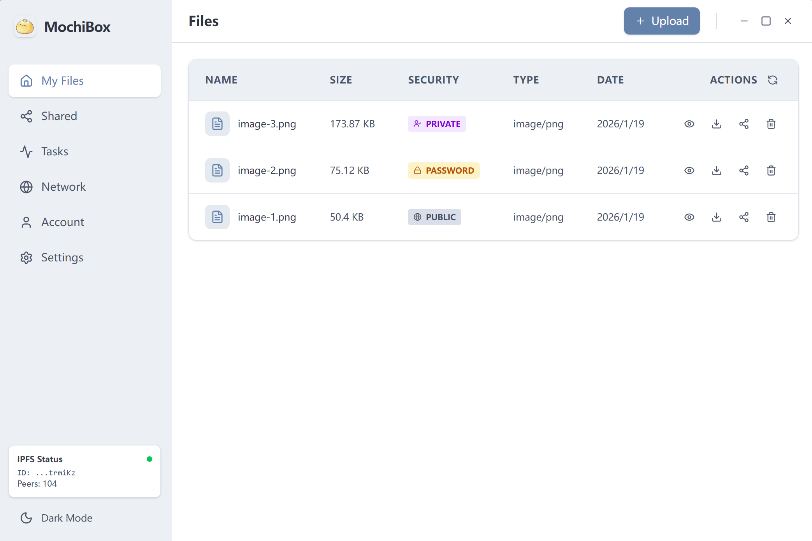

# MochiBox

[中文](./README.md) | [English](./README_ENG.md) 

> A secure, decentralized file sharing tool powered by IPFS.

MochiBox 是一个基于 IPFS 构建的去中心化文件分享工具, 旨在提供安全、私密且易于使用的文件传输体验.



## Features

- **Decentralized Storage**: 基于 IPFS 技术,文件分片存储,无中心化服务器.
- **End-to-End Encryption**: 支持端到端加密模式,确保文件仅接收者可见.
- **Cross-Platform**: 支持 Windows、macOS 和 Linux.

## Installation Instructions

直接从 [GitHub Releases](https://github.com/koabula/MochiBox/releases) 页面下载对应系统的安装包

## How to Use it

### Init MochiBox

1. 第一次启动MochiBox后, 请选择 Create New Account. 这会在本地生成一个新的密钥对(wallet), 这将作为用户的唯一标识. 请妥善保管好自己的助记词, 因为它是恢复账号的唯一方式.
2. 之后需要你设置密码,该密码用于保护你本地的数据和打开MochiBox时的认证.
3. MochiBox基于IPFS, 请在Settings中开启Use Built-in IPFS Node, 这将自动启动IPFS节点. 或者你也可以手动配置你自己的IPFS节点地址.
4. 完成以上步骤后, 你就可以开始使用MochiBox了.

### Upload a File

在MochiBox的右上角,点击Upload按钮进行上传文件,目前有三种模式:
1. **Public**: 所有用户都可以查看并下载该文件.
2. **Password**: 你需要输入一个password, 只有知道password的用户才能查看并下载该文件.
3. **Private**: 你需要输入一个用户的id(在对方的Account界面中查看,实质为对方的公钥),只有该用户才能查看并下载该文件.

上传成功后, 你可以在My Files中查看上传的文件, 并可以进行预览, 下载, 分享和删除. 其中,Private模式的文件只能在你是被分享人的情况下才能查看.

Private模式是端到端加密的(E2EE),简单来说,整个过程中只有你和被分享人能够解密并查看文件内容. 其他用户即使知道了文件的IPFS CID,也无法解密并查看文件内容.

### Get a File

在My Files中, 你可以生成文件的分享链接(Mochi Link),是一个"mochi://"开头的URL. 

如果你收到了一个Mochi Link, 你可以在Shared界面输入这个Link. 然后你可以预览,下载或Pin这个文件.(Password模式下,你需要输入正确的password)

其中,Pin指的是将文件添加到你的IPFS节点中, 这样你就可以在任何时候通过IPFS协议下载这个文件, 即使分享人已经下线.

## Build Instructions

本项目采用 Go 后端 + Electron 前端,构建前请确保已安装 **Node.js (v20+)** 和 **Go (v1.21+)**.

1. **安装依赖**
   ```bash
   npm install
   ```

2. **构建后端与前端**
   
   在根目录下运行构建命令：
   ```bash
   npm run build
   ```
   
   该命令会自动执行以下步骤：
   - 下载 IPFS 二进制依赖
   - 编译 Go 后端核心
   - 构建 Vue 前端资源
   - 移动资源到 Electron 目录

3. **打包发布**

   进入 `electron` 目录并根据目标平台运行打包命令：

   ```bash
   cd electron
   
   # Windows (生成 .exe)
   npm run dist -- --win
   
   # Linux (生成 .AppImage, .deb)
   npm run dist -- --linux
   
   # macOS (生成 .dmg)
   npm run dist -- --mac
   ```

4. **输出产物**
   打包完成后,安装包将位于 `electron/dist_electron` 目录下.

## License

本项目基于 [GPL-3.0](LICENSE) 协议开源.
